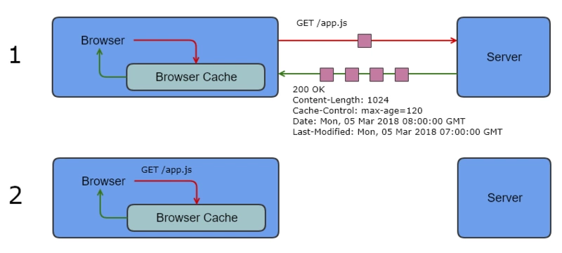
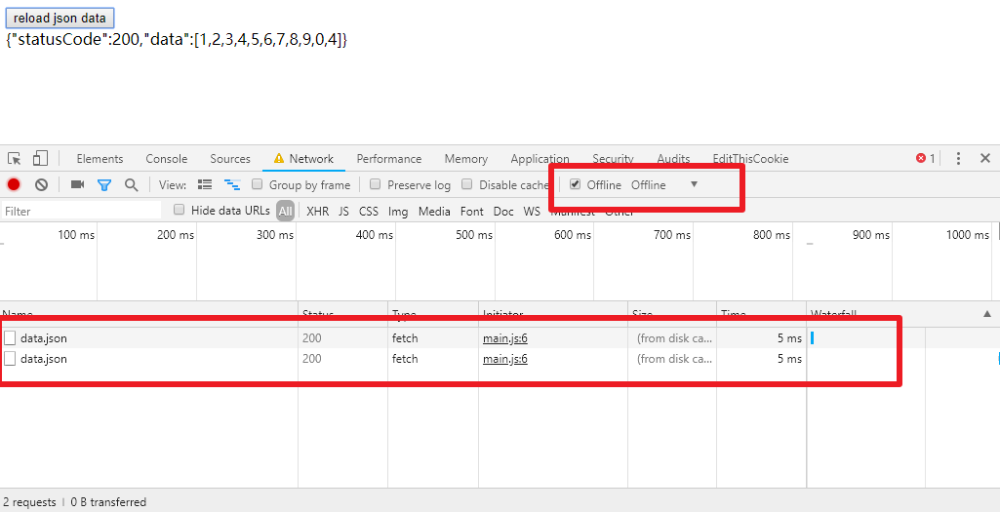

# HTTP 缓存

重用已获取的资源能够有效的提升网站与应用的性能。缓存能够减少延迟与网络阻塞，进而减少显示某个资源所用的时间。借助 HTTP 缓存，Web 站点变得更具有响应性。

## 概述

**缓存是一种保存资源副本并在下次请求时直接使用该副本的技术。**

当 web 缓存发现请求的资源已经被存储，它会拦截请求，返回该资源的拷贝，而不会去源服务器重新下载。

这样带来的好处有：缓解服务器端压力，提升性能(获取资源的耗时更短了)。

对于网站来说，缓存是达到高性能的重要组成部分。

缓存需要合理配置，因为并不是所有资源都是永久不变的：**重要的是对一个资源的缓存应截止到其下一次发生改变**（即不能缓存过期的资源）。

## 预览

接下来看一个简单的缓存实例:



浏览器首次请求 `app.js` 时，服务器会返回资源内容和相关头部。

其中 `Cache-Control: max-age=120` 告诉浏览器说，这个资源的缓存有效期为 120 秒，从当前时间 `Date: Mon, 05 Mar 2018 08:00:00 GMT` 开始算起。浏览器收到资源后便将 `app.js` 及其相应头部存储在本地。

如果在 `05 Mar, 2018 08:02:00 GMT` 之前再次请求 `app.js` ，则浏览器会直接使用存储在本地的资源，而不用再次向服务器发起请求。

## 几个基本概念

* 命中：存有可以使用的缓存文件
* 过期：缓存数据超过设置的有效时间
* 验证：与服务器交互确认缓存是否有效
* 失效：缓存数据不在有效

如上面的示例

1. 当浏览器首次请求 `app.js`的时候，本地没有缓存，所以需要从服务器下载缓存文件。
2. 浏览器保存下载文件，并记录服务器设置过期时间
3. 第二次请求的时候发现本地有缓存，并且没有过期，可以直接使用本地的缓存文件

## 代理

在网络请求中，代理也是十分常见的一环。

当访问某个网站的时候，可能并不是直接连接到了该网站的服务器，也许只是连接到了一个代理服务器(如 Nginx 或者公司搭建的 IPS 服务器)，然后这个代理服务器再和真正的网站服务器进行连接。

为了更高效的服务用户，代理服务器通常也会缓存一些数据，而不是每次请求都转发到真正的服务器。

## 基本理解

HTTP 缓存的理解基本上可以总结为三个问题:

1. 缓存数据可以存储在哪些设备上？

   可以存储于各级代理服务器，也可以存储于浏览器本地。

2. 缓存数据如何判断过期？

   通过服务器设置的过期时间判断是否过期。

3. 过期缓存内容是否真的需要重新下载？

   缓存虽然过期了，但是其内容仍然可能与服务端一致，这时就没必要重新下载相同数据，只需要向服务端询问下是否可以继续使用缓存即可。

带着这三个问题去理解 HTTP 缓存首部会更有助于理解和记忆。

## 缓存首部

HTTP 缓存主要通过 HTTP 首部来实现缓存控制。这些与缓存相关的 HTTP 首部这里统称为 **缓存首部**，具体首部如下表所示。

| 首部字段          | 首次定义 | 首部类型 |
| ----------------- | -------- | -------- |
| Pragma            | HTTP/1.0 | 通用首部 |
| Age               | HTTP/1.1 | 响应首部 |
| Expires           | HTTP/1.0 | 实体首部 |
| Cache-Control     | HTTP/1.1 | 通用首部 |
| Etag              | HTTP/1.1 | 响应首部 |
| If-Match          | HTTP/1.1 | 请求首部 |
| If-None-Match     | HTTP/1.1 | 请求首部 |
| If-Modified-Since | HTTP/1.0 | 请求首部 |
| Last-Modified     | HTTP/1.0 | 实体首部 |

其中，“**首次定义**” 是指首次出现在哪个 HTTP 版本。之所以列出这项内容，是因为实际应用需要考虑 **兼容旧版 HTTP** 。

现代的 HTTP 缓存策略主要使用 **` Cache-Control  `** 实现，它是目前最新的缓存首部，用于取代较老的缓存首部如 `Pragma` 、`Expires` 等。

所以应用中应该倾向于使用 **`Cache-Control`** 。但是为了支持只实现了 HTTP/1.0 的客户端设备，服务端通常还是都会**同时设置** `Expires`、`Pragma` 和 `Cache-Control` 等。

## Cache-Control

`HTTP/1.1` 定义的 `Cache-Control`头用来区分对缓存机制的支持情况， 请求头和响应头都支持这个属性。通过它提供的不同的值来定义缓存策略。

`Cache-Control` 通用消息头字段被用于在 `http` 请求和响应中通过指定指令来实现缓存机制。

缓存指令是单向的，这意味着在请求设置的指令，在响应中不一定包含相同的指令。

### 缓存请求指令

```http
# 客户端可以在HTTP请求中使用的标准 Cache-Control 指令。
Cache-Control: max-age=<seconds>
Cache-Control: max-stale[=<seconds>]
Cache-Control: min-fresh=<seconds>
Cache-control: no-cache 
Cache-control: no-store
Cache-control: no-transform
Cache-control: only-if-cached
```

### 缓存响应指令

```http
# 服务器可以在响应中使用的标准 Cache-Control 指令。
Cache-control: must-revalidate
Cache-control: no-cache
Cache-control: no-store
Cache-control: no-transform
Cache-control: public
Cache-control: private
Cache-control: proxy-revalidate
Cache-Control: max-age=<seconds>
Cache-control: s-maxage=<seconds>
```

### 指令说明

#### 可缓存性

* `public` 表明响应可以被任何对象（包括：发送请求的客户端，代理服务器，等等）缓存。

* `private` 表明响应只能被单个用户缓存，不能作为共享缓存（即代理服务器不能缓存它）。

* `no-cache` 这个并非字面意义上的"不使用缓存"，而是每次使用缓存前都需要和服务器确认缓存是否过期

  * 请求头包含这个字段的时候，浏览器和所有代理服务器都 **必须直接从源服务器下载最新的资源**

  * 响应头包含这个字段的时候，浏览器每次使用该资源的时候都 **必须和服务器确认该资源是否过期**

    如果未过期则仅返回 `304` 状态码不包含文件体。

    如果过期则返回 `200` 状态码 ，浏览器重新下载该资源。( Chrome 浏览器中 `Javascript` 拿不到 `304` 状态码，304 状态码都被转换成 200 了 )

    注意：这里 **必须有一个有效的确认资源是否过期的手段**，比如浏览器的请求头需要包含 `If-Modified-Since`或者 `ETag`之类能够让服务器识别当前资源版本的标识。如果不包含这些标识，服务器会返回 `200` 状态码然后导致浏览器重新下载该资源。

* `only-if-cached` 表明客户端愿意已缓存的响应，并且不要向原始服务器检查是否有更新的拷贝

  比如代理缓存了该请求的数据，但是源服务器已经挂了，中间代理可以返回缓存数据给客户端使用

#### 过期设置

* `max-age=<seconds>`  设置缓存存储的最大周期，超过这个时间缓存被认为过期(单位秒)

  这个字段表明多少秒内浏览器可以直接使用上次请求的结果，**无需和服务器进行连接**。

  只要浏览器有缓存，即使网络断开依然会返回数据。

  example:

  首次请求:

  ```http
  GET /api/data.json HTTP/1.1
  Host: localhost:3000
  Connection: keep-alive
  User-Agent: Mozilla/5.0 (Windows NT 10.0; Win64; x64) AppleWebKit/537.36 (KHTML, like Gecko) Chrome/70.0.3538.102 Safari/537.36
  Accept: */*
  Referer: http://localhost:3000/max-age.html
  Accept-Encoding: gzip, deflate, br
  Accept-Language: zh-CN,zh;q=0.9,en-US;q=0.8,en;q=0.7,zh-TW;q=0.6
  ```

  ```http
  HTTP/1.1 200 OK
  Content-Length: 34
  Last-Modified: Thu, 06 Dec 2018 04:28:58 GMT
  Content-Type: application/json; charset=utf-8
  Date: Thu, 06 Dec 2018 09:57:44 GMT
  Connection: keep-alive
  ```

  断开网络，继续发送请求，依然可以获取到结果:

  ```http
  GET /api/data.json HTTP/1.1
  Host: localhost:3000
  Connection: keep-alive
  Cache-Control: max-age=200
  User-Agent: Mozilla/5.0 (Windows NT 10.0; Win64; x64) AppleWebKit/537.36 (KHTML, like Gecko) Chrome/70.0.3538.102 Safari/537.36
  Accept: */*
  Referer: http://localhost:3000/max-age.html
  Accept-Encoding: gzip, deflate, br
  Accept-Language: zh-CN,zh;q=0.9,en-US;q=0.8,en;q=0.7,zh-TW;q=0.6
  ```

  ```http
  HTTP/1.1 200 OK
  Content-Length: 34
  Last-Modified: Thu, 06 Dec 2018 04:28:58 GMT
  Content-Type: application/json; charset=utf-8
  Date: Thu, 06 Dec 2018 09:57:44 GMT
  ```

  

  **注意：如果请求头和响应头都包含`max-age`，以二者中较小的值为准 (详见 [rfc2616#14.9.3](https://www.w3.org/Protocols/rfc2616/rfc2616-sec14.html#sec14.9.3))。**

指令不区分大小写，并且具有可选参数，可以用令牌或者带引号的字符串语法。多个指令以逗号分隔。


## 缓存首部优先级


## 其他

* `no-cache` 与 `max-age=0` 的区别

  如果出现在响应头中，二者没有差别。

  如果出现在请求头中: 

  * `no-cache` 浏览器和所有代理服务器都必须直接从源服务器下载最新的资源

    ``` http
    GET /api/data.json HTTP/1.1
    Host: localhost:3000
    Connection: keep-alive
    Cache-Control: no-cache
    User-Agent: Mozilla/5.0 (Windows NT 10.0; Win64; x64) AppleWebKit/537.36 (KHTML, like Gecko) Chrome/70.0.3538.102 Safari/537.36
    Accept: */*
    Referer: http://localhost:3000/max-age.html
    Accept-Encoding: gzip, deflate, br
    Accept-Language: zh-CN,zh;q=0.9,en-US;q=0.8,en;q=0.7,zh-TW;q=0.6
    ```

    ```http
    HTTP/1.1 200 OK
    Content-Length: 34
    Last-Modified: Thu, 06 Dec 2018 04:28:58 GMT
    Cache-Control: max-age=50
    Content-Type: application/json; charset=utf-8
    ETag: W/"22-16781c6a63d"
    Date: Thu, 06 Dec 2018 12:16:43 GMT
    Connection: keep-alive
    ```

  * `max-age=0` 浏览器会和服务器确认资源是否过期，然后决定使用缓存还是重新从服务器下载。

    ```http
    GET /api/data.json HTTP/1.1
    Host: localhost:3000
    Connection: keep-alive
    Cache-Control: max-age=0
    User-Agent: Mozilla/5.0 (Windows NT 10.0; Win64; x64) AppleWebKit/537.36 (KHTML, like Gecko) Chrome/70.0.3538.102 Safari/537.36
    Accept: */*
    Referer: http://localhost:3000/max-age.html
    Accept-Encoding: gzip, deflate, br
    Accept-Language: zh-CN,zh;q=0.9,en-US;q=0.8,en;q=0.7,zh-TW;q=0.6
    If-None-Match: W/"22-16781c6a63d"
    If-Modified-Since: Thu, 06 Dec 2018 04:28:58 GMT
    ```

    ```http
    HTTP/1.1 304 Not Modified
    Last-Modified: Thu, 06 Dec 2018 04:28:58 GMT
    Cache-Control: max-age=50
    ETag: W/"22-16781c6a63d"
    Date: Thu, 06 Dec 2018 12:18:53 GMT
    Connection: keep-alive
    ```


> **本文复制了参考资料中的大段文字，因为我觉得原文写得非常好，没有修改的必要。在此对原作者表示感谢，如果侵犯到了你的权益，请联系删除。**
>
> 本文作者水平有限，若有理解欠缺或偏差之处，望不吝赐教。
>
> 参考资料:
>
> [HTTP缓存(MDN)](https://developer.mozilla.org/zh-CN/docs/Web/HTTP/Caching_FAQ)
>
> [HTTP缓存(Google)](https://developers.google.com/web/fundamentals/performance/optimizing-content-efficiency/http-caching)
>
> [图说 HTTP 缓存](https://segmentfault.com/a/1190000013562838)
>
> [HTTP缓存控制小节](http://imweb.io/topic/5795dcb6fb312541492eda8c)
>
> [【腾讯Bugly干货分享】彻底弄懂 Http 缓存机制 - 基于缓存策略三要素分解法](https://zhuanlan.zhihu.com/p/24467558)
>
> [RFC2616](https://www.w3.org/Protocols/rfc2616/rfc2616-sec14.html)


